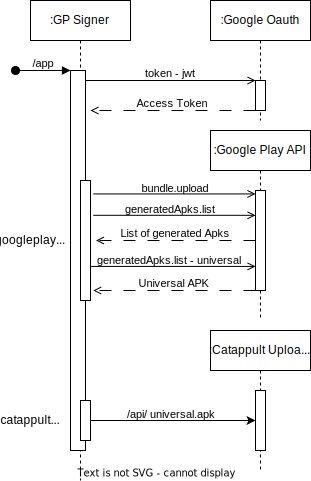
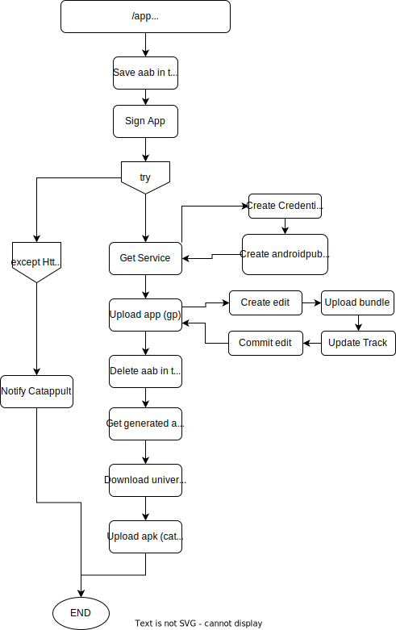

# Google Play Signer

- [Google Play Signer](#google-play-signer)
  - [💻 About](#-about)
  - [⚙️ Design/Features](#️-designfeatures)
  - [🚀 How to install it](#-how-to-install-it)
  - [🚀 How to run it](#-how-to-run-it)
  - [🧪 How to test it](#-how-to-test-it)
  - [🛠 Techs](#-techs)

## 💻 About

'Google Play Signer' is an API for upload bundles with the upload signature 
and getting the signed APK by Google Play.

## ⚙️ Design/Features


### Flow


The service will receive the aab signed with the upload key, the catappult uid,
the package_name and the version code. The aab will be saved in tmp so it can
be accessed by the task running in the thread pool. This task will upload the
aab to google play, download the universal APK and upload it to Catappult.

If the google client library throws any unexpected exception (HttpError) it
will notify catappult of the error so it can then notify the user.

### Design choices
During discussions with catappult it was decided for now to only upload the
universal apk, the functions to download the other apk types (splits and
standalones) already exist in the code, but when it is decided to upload more
types it will have to be discussed how to work with the uploader API to
differenciate the different type and different variants (See confluence
docs about variants)

## 🚀 How to install it

If running with poetry:
```sh
poetry install
```

## 🚀 How to run it

With poetry:
```sh
poetry shell
ENVIRONMENT=DEVELOPMENT gunicorn google_play_signer.main:app -b 0.0.0.0:8000
```

By default it will run in PRODUCTION settings

## 🧪 How to test it
To test the service we can use the package registered in catappult and google
play `com.apptech.gpsigner`.
To create the aab use Android Stuido to create a sample app with the package
name, generate the aab in Build>Generate Signed Bundle/APK, generate the
release bundle using the provided keystore using alias and password `apptech`

Tu use the API loading all necessary data and authorization run the following
script:

```py
import requests
from jose import jwt
import json
from google_play_signer.config import load_pem_key

with open('pure-muse-386209-ab0ae0ecfc8f.json', 'r') as f:
    gp_key = json.load(f)

key = load_pem_key('apptechRS512_dev.key')
token = jwt.encode({'iss': 'apptech.aptoide.com'}, key)
headers = {'Authorization': f'Bearer {token}'}

r = requests.post('http://127.0.0.1:8000/app/c59dd2df-a95b-4ab4-894d-84319615e40e/com.apptech.gpsigner/{version_code}',
                  headers=headers,
                  data={'user_credentials': json.dumps(gp_key)},
                  files={'file': open('app-release.aab', 'rb')})
```

Replace `{version_code}` with the version coded defined in gradle and ensure
that it is different than 1. GP API does not allow the upload of bundles with
the same version code and does not allow the deletion of bundles associated
with a release track. During tests the version code 1 was added to the internal
test release track.

After testing make sure you delete the uploaded bundle in GP by going to GP
console (apptech account) > Aptoide com organization (if page of org choice
appears), two apps will appear choose the app with package name
com.apptech.gpsigner app, finaly on the side menu click in App bundle explorer,
select the version code by clicking in the arrow at the right end of the card,
and click in delete bundle.

To confirm the app was uploaded to catappult dev you can go to
dev.catappult.io, ask João Melo for the credentials.

## 🛠 Techs
* Python 3.9
* Docker
